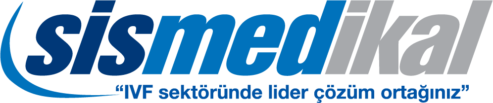

# Sismedikal Website
<p align="center">
  
</p>

[](LICENSE.txt)

Sismedikal is a responsive website developed with React and Next.js for Turkey's leading IVF product distributor company. This real-life project delivers an engaging and professional online presence for Sismedikal, ensuring optimal performance on desktops, tablets, and mobile devices. Visit the live website at [sismed.com](https://sismed.com).

## Overview

Commissioned by Sismedikal, this website was built to showcase their IVF products and services in a modern and user-friendly manner. Leveraging React and Next.js, the project emphasizes fast load times, SEO-friendly pages, and a smooth user experience across all devices.

## Technologies Used

- **React:** For building the dynamic user interface.
- **Next.js:** For server-side rendering and improved performance.
- **Responsive Design:** Ensures the website looks great on any screen size.

## Features

- **Responsive Layout:** Seamless experience across desktops, tablets, and smartphones.
- **Modern UI/UX:** Clean and professional design tailored to the IVF product market.
- **Optimized Performance:** Fast load times and enhanced SEO with Next.js.
- **Real-Life Application:** Developed as a professional job for Sismedikal.

## Installation & Setup

1. **Clone the Repository:**

   ```bash
   git clone https://github.com/alqeren1/sismedikal_website.git
   ```

2. **Navigate to the Project Directory:**

   ```bash
   cd sismedikal_website
   ```

3. **Install Dependencies:**

   ```bash
   npm install
   ```

4. **Run the Development Server:**

   ```bash
   npm run dev
   ```

## Deployment

To create a production build:

   ```bash
   npm run build
   ```

Deploy the generated build directory to your preferred hosting provider.

## Learning Outcomes

This project was developed as a real-life job to:

- Gain hands-on experience with building responsive websites using React and Next.js.
- Understand and implement modern UI/UX design for a professional market.
- Deliver a performant and visually engaging online presence for a leading IVF product distributor.

## Live Website

Visit the live website at [sismed.com](https://sismed.com).

## License

This project is licensed under the [MIT License](LICENSE).

## Contact

For any questions or further discussion, please reach out via [alqeren1](https://github.com/alqeren1) or email [alqeren1@gmail.com](mailto:alqeren1@gmail.com).
